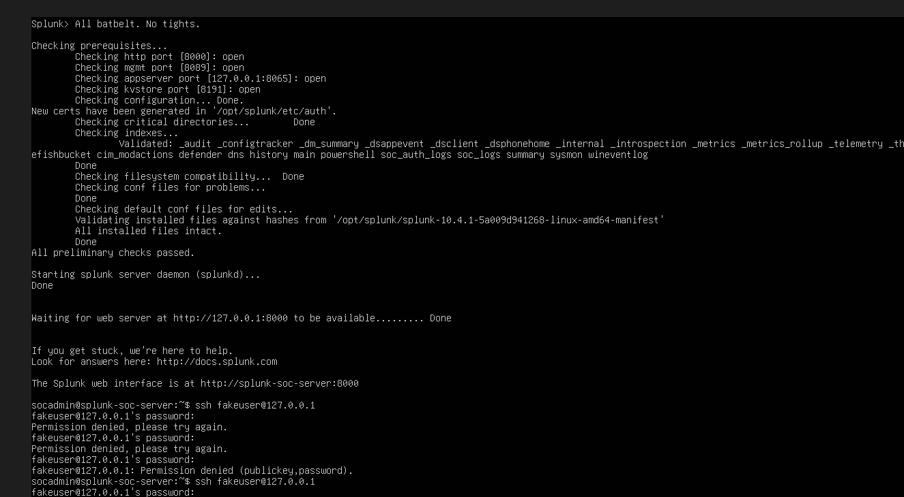
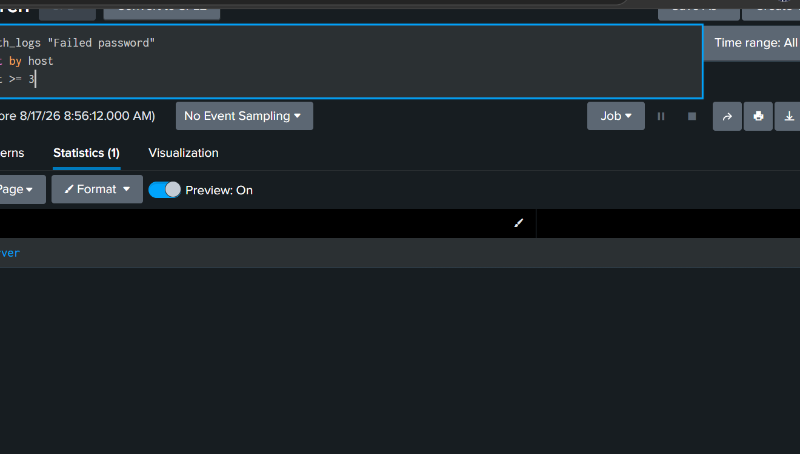
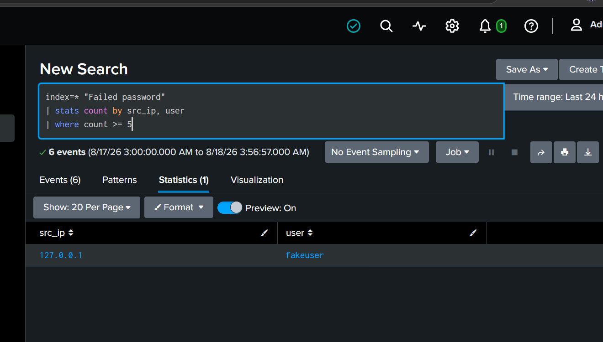
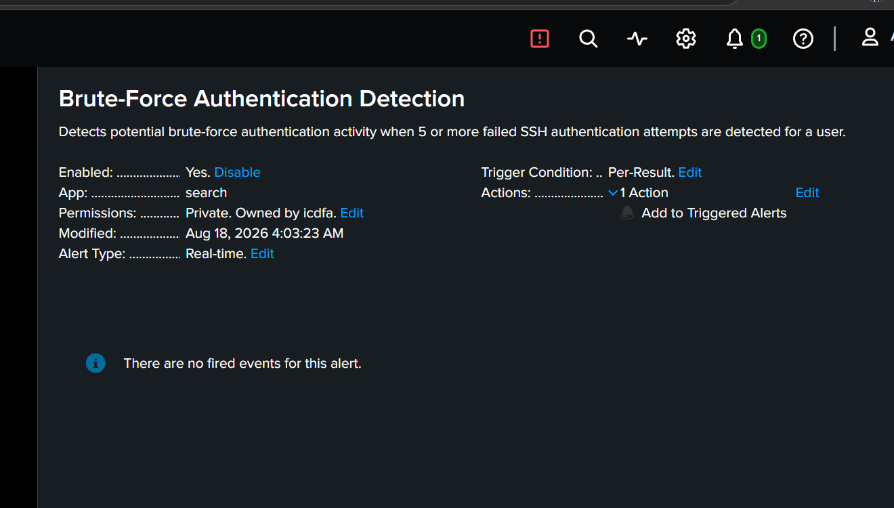
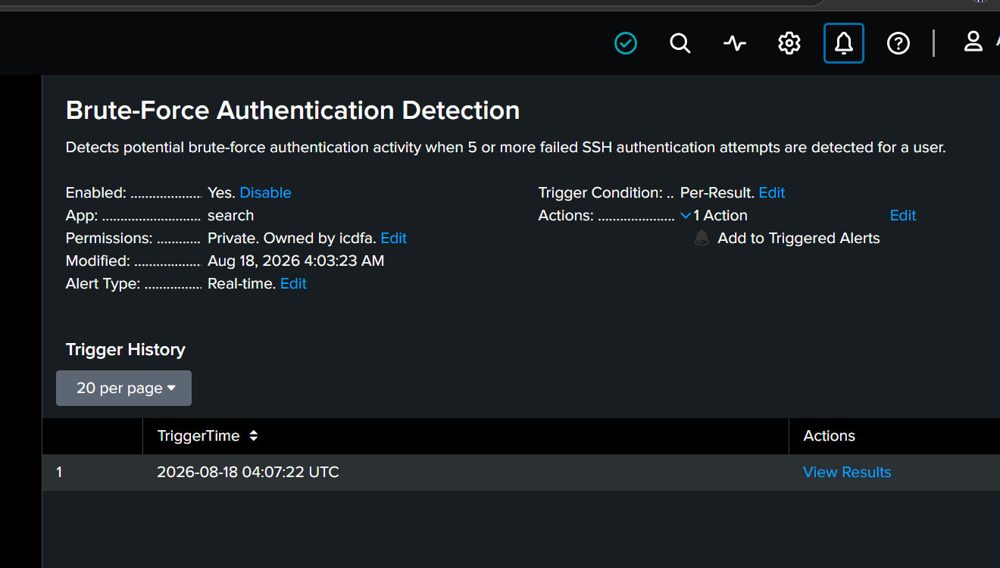
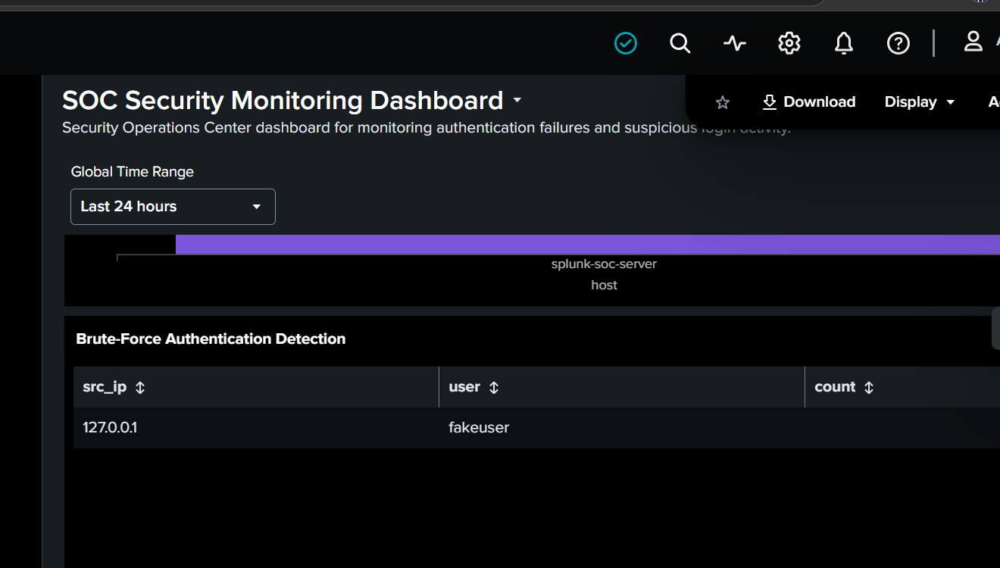

# Splunk SOC Lab

## Overview

This project demonstrates hands-on experience using Splunk for Security Operations Center (SOC) monitoring, log analysis, brute-force detection, and security alerting.

## Objectives

- Configure and use Splunk for security monitoring
- Analyze authentication logs
- Identify failed login activity
- Detect potential brute-force attacks
- Create security alerts
- Build a basic SOC monitoring dashboard

## Lab Scenario

A brute-force authentication attack was simulated against the Splunk environment by generating multiple failed login attempts.

The activity was then investigated using Splunk searches and visualized through a SOC dashboard.

## Investigation Process

### 1. Brute-Force Simulation

A series of failed authentication attempts were generated to simulate suspicious login activity.

### 2. Failed Authentication Analysis

Splunk was used to search and analyze failed authentication events.

### 3. Brute-Force Detection

The authentication events were analyzed to identify patterns consistent with a brute-force attack.

### 4. Alert Configuration

A Splunk alert was configured to detect repeated failed authentication attempts.

### 5. Alert Triggered

The configured alert successfully triggered when the defined brute-force conditions were met.

### 6. SOC Dashboard

A dashboard was created to provide a visual overview of the authentication activity and detected security events.

## Skills Demonstrated

- Splunk
- SIEM monitoring
- Log analysis
- Authentication event analysis
- Brute-force attack detection
- Security alert configuration
- SOC investigation
- Security dashboard development

## Key Outcome

This lab demonstrates the ability to use Splunk to collect and analyze security events, investigate suspicious authentication activity, detect brute-force behavior, configure alerts, and present security findings through a SOC dashboard.
