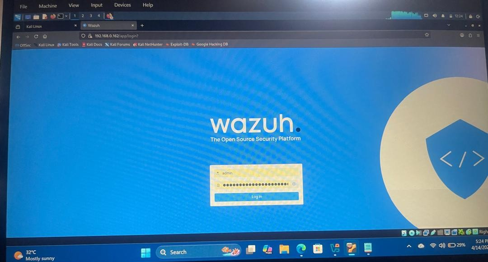
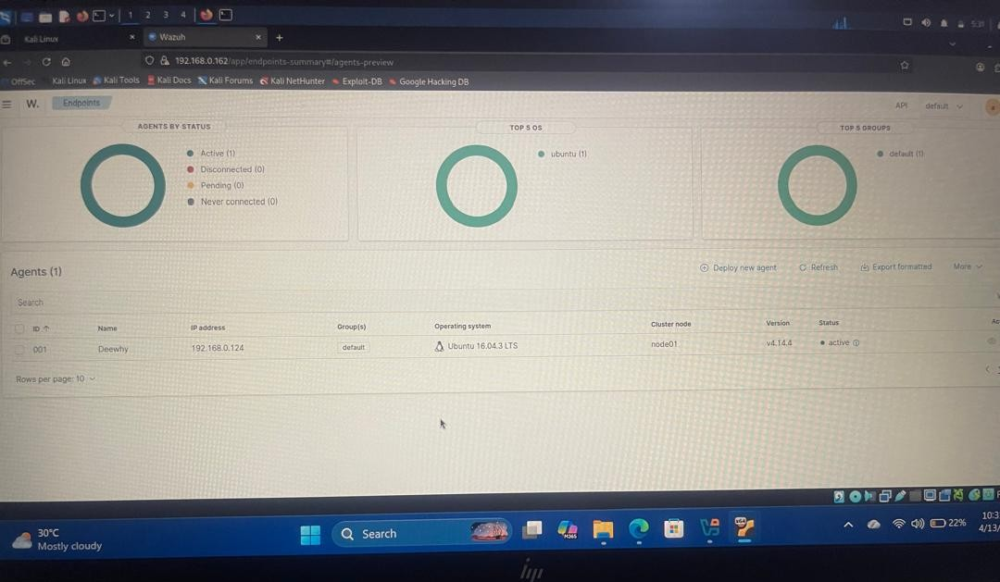
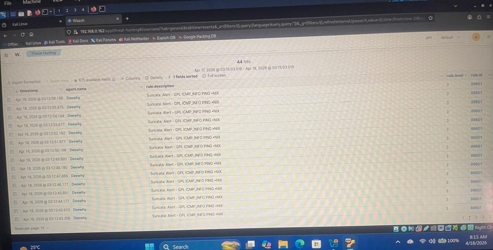
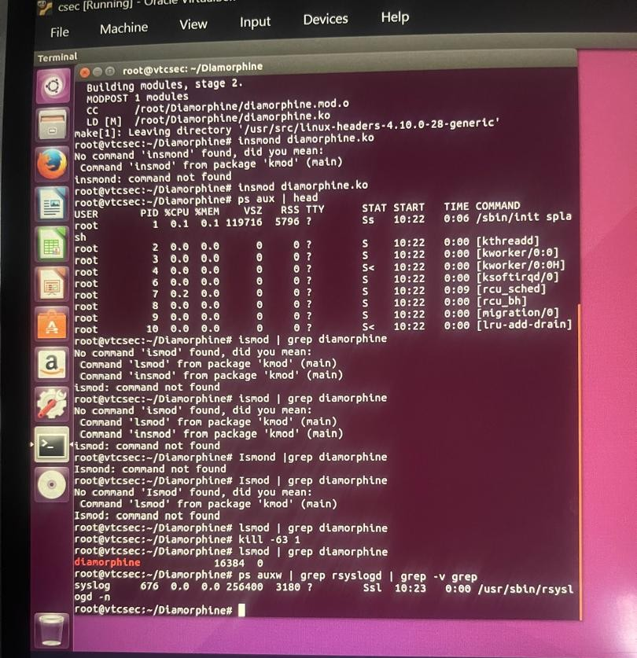
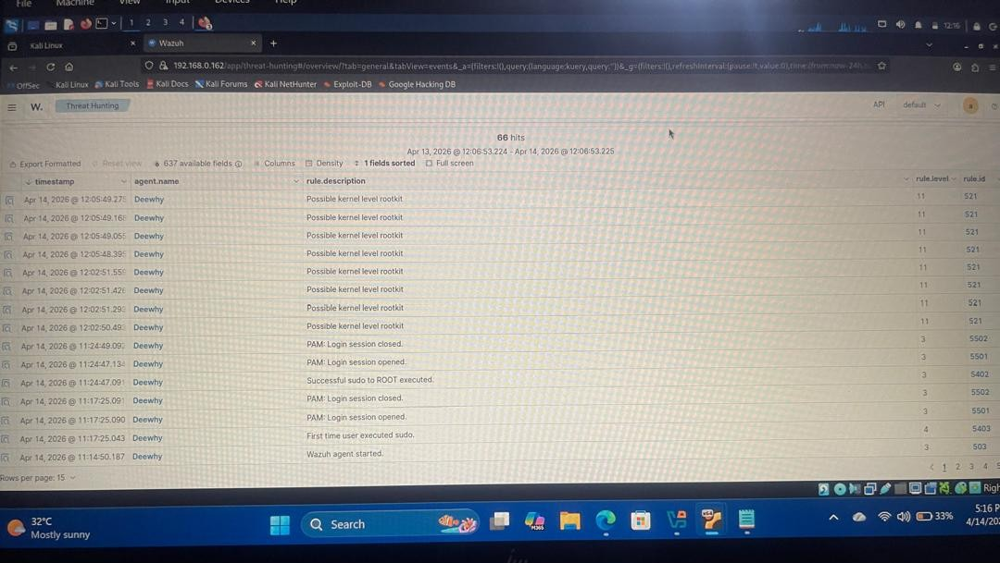
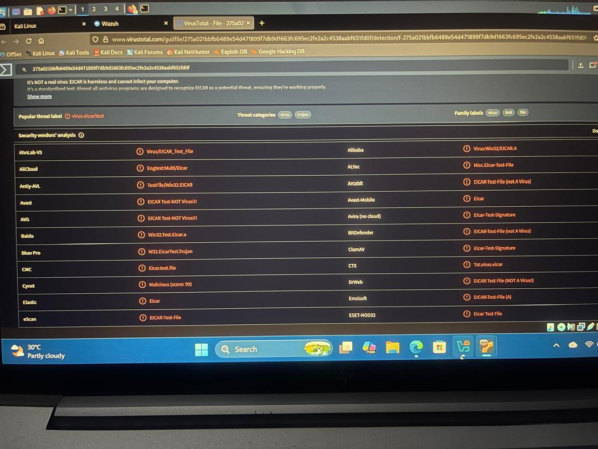
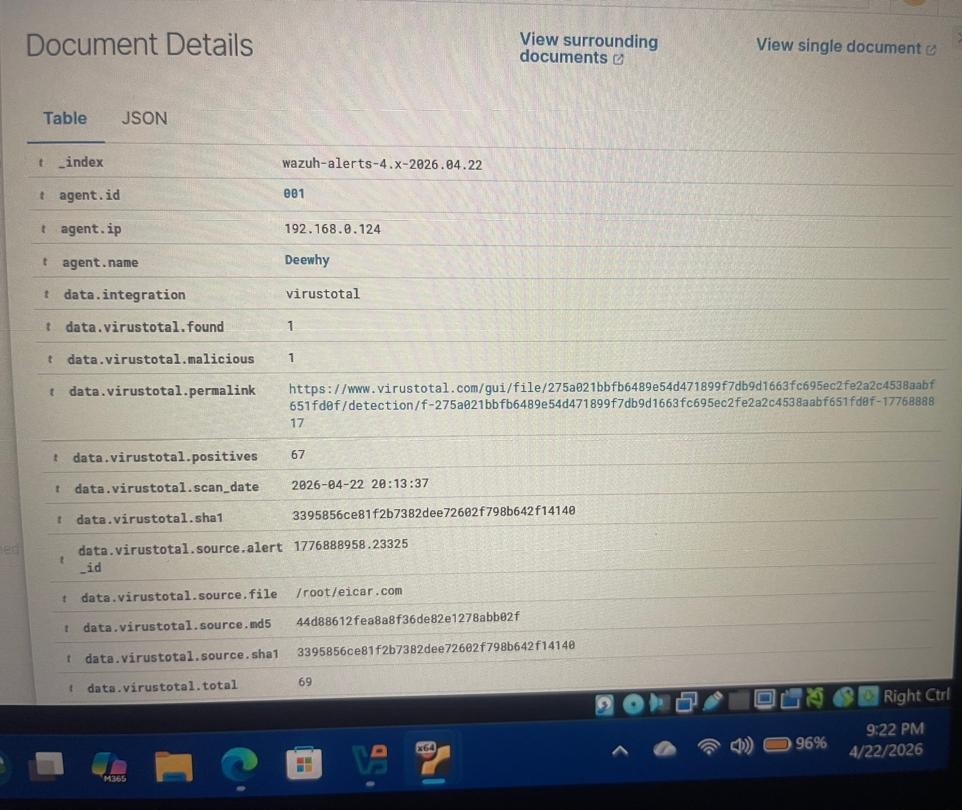
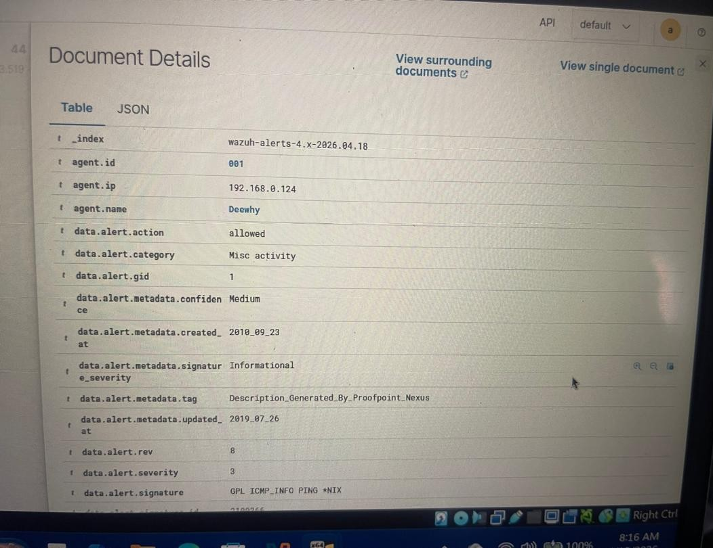

# Wazuh SOC Detection & Threat Intelligence Lab

## Project Overview

This project documents a hands-on Security Operations Center (SOC) lab built using Wazuh. The objective was to deploy a functional SIEM environment, monitor an Ubuntu endpoint, generate controlled security events, investigate alerts, and enrich security findings using external threat intelligence.

The lab was conducted in Oracle VM VirtualBox, with Kali Linux configured as the Wazuh server and Ubuntu configured as the monitored endpoint.

The project covered endpoint monitoring, file integrity monitoring, rootkit detection, security alert analysis, and VirusTotal integration for file reputation and threat intelligence enrichment.

## Objectives

- Deploy and configure a Wazuh SIEM environment.
- Connect and monitor an Ubuntu endpoint using the Wazuh agent.
- Collect and analyze security events and system activity.
- Simulate controlled security events for detection testing.
- Investigate rootkit-related alerts using Diamorphine.
- Use the EICAR test file to safely simulate malware activity.
- Configure File Integrity Monitoring (FIM).
- Integrate Wazuh with VirusTotal for automated file reputation checks.
- Practice SOC-style alert investigation and threat analysis.

## Lab Environment

| Component | Purpose |
|---|---|
| Kali Linux | Wazuh Server / SIEM |
| Ubuntu Linux | Monitored Endpoint / Wazuh Agent |
| Oracle VM VirtualBox | Virtualization Platform |
| Wazuh | SIEM, endpoint monitoring and detection |
| VirusTotal | Threat intelligence and file reputation |
| Diamorphine | Controlled rootkit detection simulation |
| EICAR Test File | Safe malware detection simulation |


## Lab Architecture

The lab was built in Oracle VM VirtualBox using two Linux virtual machines:

```text
                    Wazuh SOC Lab

              ┌─────────────────────┐
              │     Kali Linux      │
              │    Wazuh Server     │
              │                     │
              │  Wazuh Manager     │
              │  Wazuh API         │
              │  Wazuh Dashboard   │
              └──────────┬──────────┘
                         │
                  Security Events
                         │
                         ▼
              ┌─────────────────────┐
              │      Ubuntu        │
              │   Wazuh Agent      │
              │                     │
              │ System Logs        │
              │ File Activity      │
              │ Security Events    │
              └─────────────────────┘

## Wazuh Server Deployment



Kali Linux was configured as the Wazuh server. The Wazuh components were installed and configured to provide centralized security monitoring and analysis.

The main server components included:

-  Wazuh Manager 
-  Wazuh API 
-  Wazuh Dashboard 

After installation, I verified that the required Wazuh services were running and that the dashboard was accessible.

## Agent Deployment and Enrollment



Ubuntu Linux was configured as the monitored endpoint.

The Wazuh agent was installed on Ubuntu and enrolled with the Wazuh manager running on Kali Linux. After enrollment, I verified communication between the agent and server.

Once the connection was established, security and system events from the Ubuntu endpoint began appearing in the Wazuh dashboard.

cat >> README.md <<'EOF'

## Detection and Investigation



To validate the detection capabilities of the Wazuh environment, I simulated suspicious activity on the Ubuntu endpoint and monitored the resulting security events from the Wazuh dashboard.

### Rootkit Detection





I used the Diamorphine rootkit in the controlled lab environment to simulate rootkit-related activity.

Wazuh detected suspicious kernel-level activity and generated high-severity alerts. I reviewed the alerts in the Wazuh dashboard and examined the associated event information to understand the detected behavior.

The investigation also showed related security events, including:

- Possible kernel-level rootkit activity
- Sudo and privilege-related activity
- PAM authentication and session events

This exercise helped me understand how a SOC analyst can use SIEM alerts to identify suspicious behavior and investigate potential Indicators of Compromise (IOCs).


## Threat Intelligence Integration



To enrich security alerts with threat intelligence, I integrated Wazuh with VirusTotal for automated file reputation analysis.

### EICAR Test File Simulation





I used the EICAR test file as a safe and controlled way to simulate malware detection without using actual malicious malware.

The test workflow involved:

- Creating the EICAR test file on the monitored Ubuntu endpoint
- Using Wazuh File Integrity Monitoring (FIM) to detect the file activity
- Generating a security alert in Wazuh
- Extracting the file hash for analysis
- Querying the hash through VirusTotal
- Reviewing the resulting antivirus detections

VirusTotal provided additional context by checking the file hash against multiple security engines.

This demonstrated how a SOC analyst can combine SIEM alerts with external threat intelligence to improve alert investigation and determine whether a detected file requires further investigation.

## Key Skills Demonstrated

- SIEM deployment and configuration
- Endpoint monitoring
- Security event analysis
- File Integrity Monitoring (FIM)
- Rootkit detection
- Threat intelligence integration
- VirusTotal investigation
- IOC and file hash analysis
- Alert investigation and triage
- Linux security monitoring

## Key Takeaways

This lab strengthened my understanding of how security monitoring works in a SOC environment.

I learned that security alerts should not automatically be treated as confirmed threats. Analysts need to investigate the available evidence, understand the context of the alert, correlate related events, and determine the appropriate response.

The lab also demonstrated the value of combining SIEM capabilities with threat intelligence to provide additional context during investigations.

